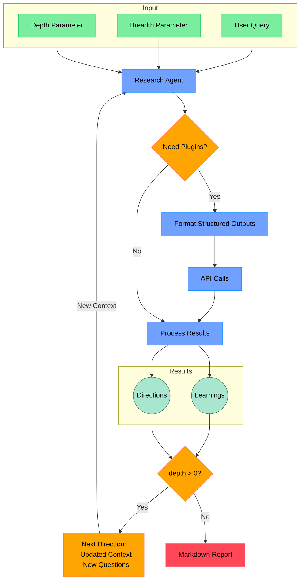

# Sapho - Open Deep Research Agent for Crypto

[Sapho](https://github.com/operator-labs/sapho) is a research agent built by [Operator Labs](https://operator.io). It is designed to buff up the core reasoner loop for any AI agent. It is designed to interact well with crypto price and onchain data, and is the core research agent for [mentat.fun](https://mentat.fun).

Thanks to [dzhng](https://github.com/dzhng) for the original [deep-research](https://github.com/dzhng/deep-research) repo, which inspired this project.

## How it works

Primarily designed for Sonar Reasoning Pro by Perplexity, but [Sapho.io](https://github.com/operator-labs/sapho.io) can theoretically use any reasoner model. 

Optional plugins can be added that leverage structured outputs to format queries to external APIs. These plugins are selectively invoked if the agent thinks that it can be useful for advancing progress on the current research topic. 

At every step of recursion, the agent evaluates whether it makes sense to incorporate a plugin, or if it makes sense continue using just its core reasoning step. 

When the agent has gathered enough information, it will synthesize the findings into a final report.

## Research Process



## Research Process
1. **Query Understanding & Setup**
   - Processes initial user query and parameters (breadth & depth)
   - Establishes research context using the reasoning model
   - Sets up initial submodule configuration based on topic

2. **Iterative Research & Analysis**
   - Executes core reasoning loop:
     - Generates targeted search queries
     - Processes results through reasoning engine
     - Dynamically evaluates and incorporates relevant API submodules
   - Maintains contextual awareness across iterations
   - Uses depth parameter to control recursive exploration
   - Accumulates and connects findings across iterations

3. **Synthesis & Reporting**
   - Consolidates findings across all research paths
   - Structures information with clear reasoning chains
   - Provides source attribution and confidence levels
   - Generates final report with actionable insights
   - Highlights areas for potential further exploration

## Requirements 

- Python 3.10+
- A model provider that supports structured outputs. We recommend Perplexity Sonar Reasoning Pro.
- FastAPI for API endpoints
- Pydantic for request/response models
- Docker for containerization (optional)

## Installation

```bash
pip install sapho fastapi uvicorn pydantic
```

## Environment Setup

Create a `.env` file in the root directory:

```bash
PERPLEXITY_API_KEY="your_perplexity_api_key"
```

### DexScreener Plugin Setup

To use the DexScreener plugin, add the following to your `.env` file:

```bash
DEXSCREENER_API_KEY="your_dexscreener_api_key"
```

## Plugin Environment Variables

As plugins are added to the system, they may require their own API keys or configuration values. Add these to your `.env` file as needed. 

## API Usage

The research agent can be accessed via REST API endpoints. The main endpoint accepts the following parameters:

```json
{
  "query": "Your research query",  // Required
  "breadth": 4,  // Optional
  "depth": 2,  // Optional
  "plugins": ["coingecko", "dexscreener"]  // Optional
}
```

Start the API server:

```bash
uvicorn sapho.api:app --reload
```

Example minimal request:

```bash
curl -X POST "http://localhost:8000/research" \
  -H "Content-Type: application/json" \
  -d '{"query": "Research topic"}'
```

Example with all parameters:

```bash
curl -X POST "http://localhost:8000/research" \
  -H "Content-Type: application/json" \
  -d '{"query": "Research topic", "breadth": 6, "depth": 3, "plugins": ["coingecko"]}'
```

Example with plugins only:

```bash
curl -X POST "http://localhost:8000/research" \
  -H "Content-Type: application/json" \
  -d '{"query": "Research topic", "plugins": ["coingecko"]}'
```

## Docker

1. Clone the repository
2. Copy `.env.example` to `.env` and set your Perplexity API key:
```bash
cp .env.example .env
```

3. Build and start the Docker container:
```bash
docker compose up -d
```

4. The API will be available at `http://localhost:8000`

You can check the logs with:
```bash
docker compose logs -f
```

5. To stop the container:
```bash
docker compose down
```

## Contributing

Want to add a new plugin? Here's how:

1. Fork the repo and create your plugin in the `plugins` directory
2. Follow the plugin template (see DexScreener plugin as example)
3. Submit a pull request with documentation and example usage

## Support

Here's how to get help:

1. Join our [Discord community](https://discord.gg/FQagDmCkvC)
2. Check the #support channel for common issues
3. Ask in #general for specific questions

## License

This project is licensed under the MIT License - see the [LICENSE](LICENSE) file for details.

