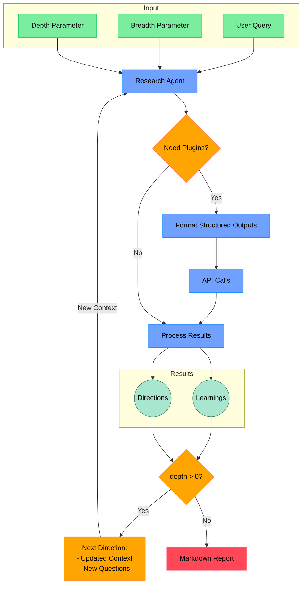

# Sapho - Deep Research Agent for Crypto

<div align="center">
  
  <p style="font-style: italic; margin-bottom: 20px;">
    Sapho Juice - The mystical substance used by Mentats to enhance their cognitive abilities
  </p>
</div>

## Overview

[Sapho](https://github.com/operator-labs/sapho) is a research agent built by [Operator Labs](https://operator.io). It is designed to buff up the core reasoner loop for any AI agent, and is designed to interact well with extensible plugins like [DexScreener](https://dexscreener.com). [mentat.fun](https://mentat.fun) uses Sapho as its core research agent. 

Thanks to [dzhng](https://github.com/dzhng) for the original [deep-research](https://github.com/dzhng/deep-research) repo, which inspired this project. 

## How it works

[Sapho](https://github.com/operator-labs/sapho) is primarily designed to use Sonar Reasoning Pro by [Perplexity](https://perplexity.ai), but can theoretically use any reasoning model. 

Optional plugins use structured outputs to format queries to external APIs. These plugins are selectively invoked if the agent thinks they can be useful for advancing progress on the current research topic. 

At every step of recursion, the agent evaluates whether it makes sense to incorporate a plugin, or if it makes sense continue using just its core reasoning step. 

When the agent has gathered enough information, it will synthesize the findings into a final report.

## Research Process



### Research Steps
1. **Query Understanding & Setup**
   - Processes initial user query and parameters (breadth & depth)
   - Establishes research context using the reasoning model
   - Sets up initial plugin configuration based on topic

2. **Iterative Research & Analysis**
   - Executes core reasoning loop:
     - Generates targeted search queries
     - Processes results through reasoning engine
     - Dynamically evaluates and incorporates relevant API plugins
   - Maintains contextual awareness across iterations
   - Uses depth parameter to control recursive exploration
   - Accumulates and connects findings across iterations

3. **Synthesis & Reporting**
   - Consolidates findings across all research paths
   - Structures information with clear reasoning chains
   - Provides source attribution and confidence levels
   - Generates final report with actionable insights
   - Highlights areas for potential further exploration

## Project Structure

```
├── src/
│   └── sapho/             # Main package
│       ├── __init__.py    # Package initialization
│       ├── __main__.py    # Entry point
│       ├── api/           # API endpoints
│       ├── core/          # Core functionality
│       ├── ai/            # AI/ML components
│       └── plugins/       # Plugin system
└── pyproject.toml        # Project configuration
```

## Installation

### From PyPI
```bash
pip install sapho
```

### From Source
```bash
git clone https://github.com/operator-labs/sapho.git
cd sapho
pip install -e ".[dev]"  # Installs with development dependencies
```

## Environment Setup

Create a `.env` file in your project root:

```bash
PERPLEXITY_API_KEY="your_perplexity_api_key"  # Required
GROK_API_KEY="your_grok_api_key"  # Optional, for Grok plugin
```

## Usage

### As a Library

```python
from sapho import ResearchAgent

agent = ResearchAgent(api_key="your_perplexity_api_key")
results = await agent.research({
    "query": "Research topic",
    "breadth": 4,  # Optional
    "depth": 2,   # Optional
})
```

### Running the API Server

```bash
uvicorn sapho.api.server:app --reload
```

### API Endpoints

#### Research Endpoint
```bash
curl -X POST "http://localhost:8000/research" \
  -H "Content-Type: application/json" \
  -d '{
    "query": "Research topic",
    "breadth": 4,
    "depth": 2,
  }'
```

#### Health Check
```bash
curl "http://localhost:8000/health"
```

## Plugin System

Plugins provide data to the research agent. The agent is smart enough to figure out when and how to use this data.

### Available Plugins

- **Grok**: Use Grok to get context from X (Twitter). 

### Creating a Custom Plugin

```python
from sapho.plugins.base import Plugin
from typing import Dict, Any
from pydantic import BaseModel

class TokenQuery(BaseModel):
    symbol: str
    fields: list[str]

class MyPlugin(Plugin):
    @property
    def name(self) -> str:
        return "myplugin"
    
    def can_handle(self, query: str) -> bool:
        # The agent will check if it needs token data
        return True
    
    async def query(self, query: str) -> Dict[str, Any]:
        # Input: Structured query from the agent
        # e.g. {"symbol": "BTC", "fields": ["price", "volume"]}
        
        params = TokenQuery.model_validate_json(query)
        
        # Do your API call here with the structured params
        
        # Return matching the schema the agent expects
        return {
            "price": 50000,
            "volume": 1000000
        }
```

That's it! The research agent will format queries appropriately for your plugin.

## Contributing

1. Fork the repository
2. Create a feature branch
3. Make your changes
4. Submit a pull request

## Support

- Join our [Discord community](https://discord.gg/FQagDmCkvC)
- Check the #support channel for common issues
- Ask in #general for specific questions

## License

This project is licensed under the MIT License - see the [LICENSE](LICENSE) file for details.

